::: {.callout-note}
## Screenshots will be updated
The screenshots in this assignment are from a previous course iteration and will be updated before the class starts.
:::

::: {.callout-tip}
## Struggling with the setup of GitHub?
 If you need support to set up GitHub, get in touch with the course instructor and we will schedule a call to walk through it together.
:::

## Create a GitHub Personal Access Token

Here are the step-by-step instructions to set up a GitHub personal access token (PAT):

::: {.callout-important}
Treat your access tokens like passwords and keep them secure (e.g., in password management software).
:::

1.  Log in to your GitHub account.

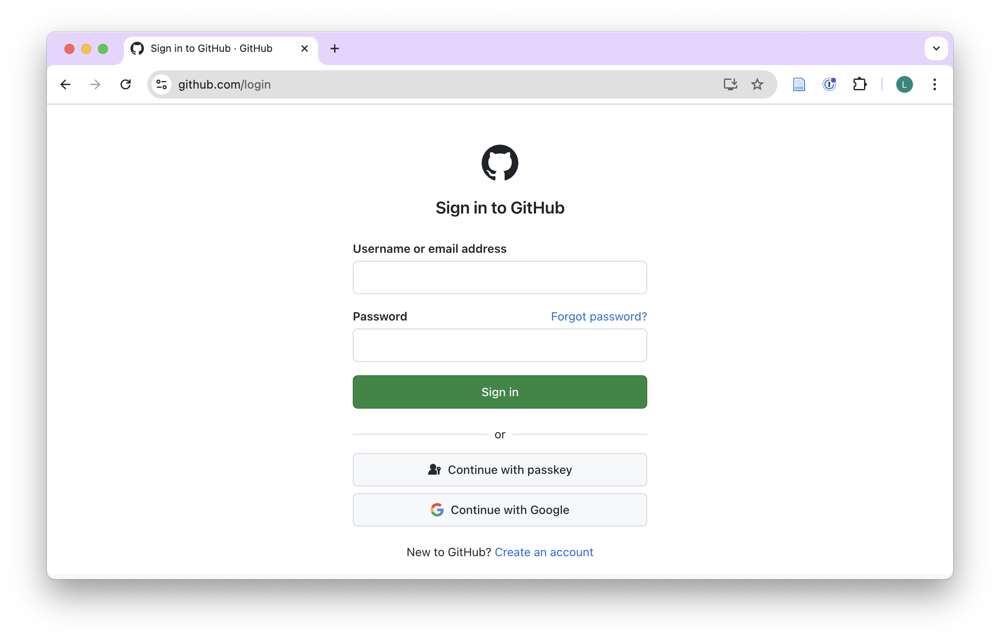{width=100%}

2.  Click on your profile picture in the top-right corner of the page.

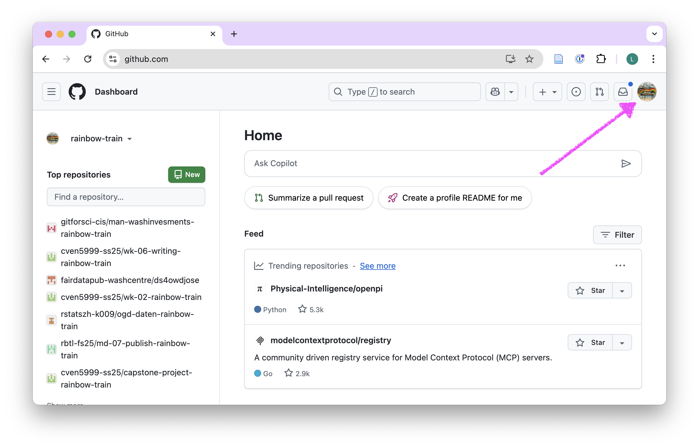{width=100%}

3.  Select [Settings]{.highlight-yellow} from the dropdown menu.

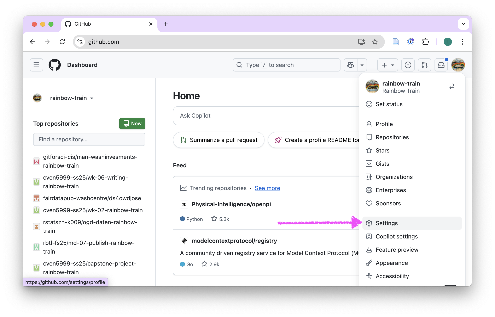{width=100%}

4.  In the left sidebar, click on [Developer settings]{.highlight-yellow}.

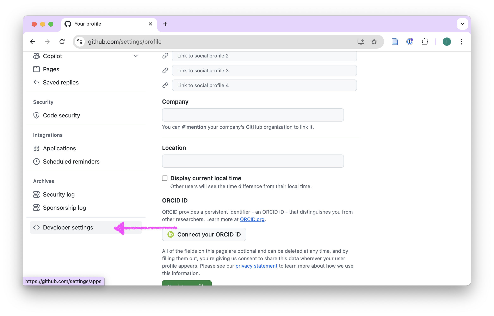{width=100%}

5.  Click on [Personal access tokens]{.highlight-yellow}.

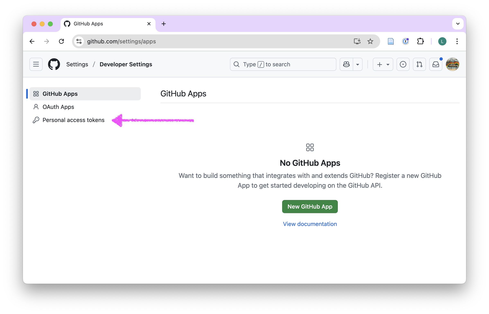{width=100%}

6.  Click on ["Tokens (classic)"]{.highlight-yellow}.

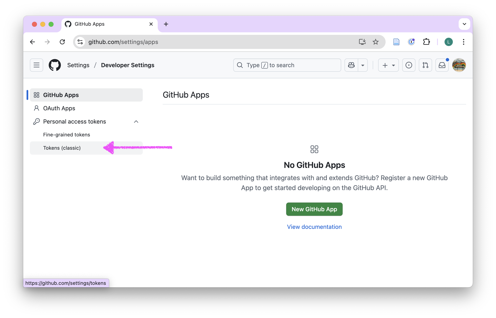{width=100%}

7.  Click on [Generate new token]{.highlight-yellow} and from the dropdown menu select [Generate new token (classic)]{.highlight-yellow}.

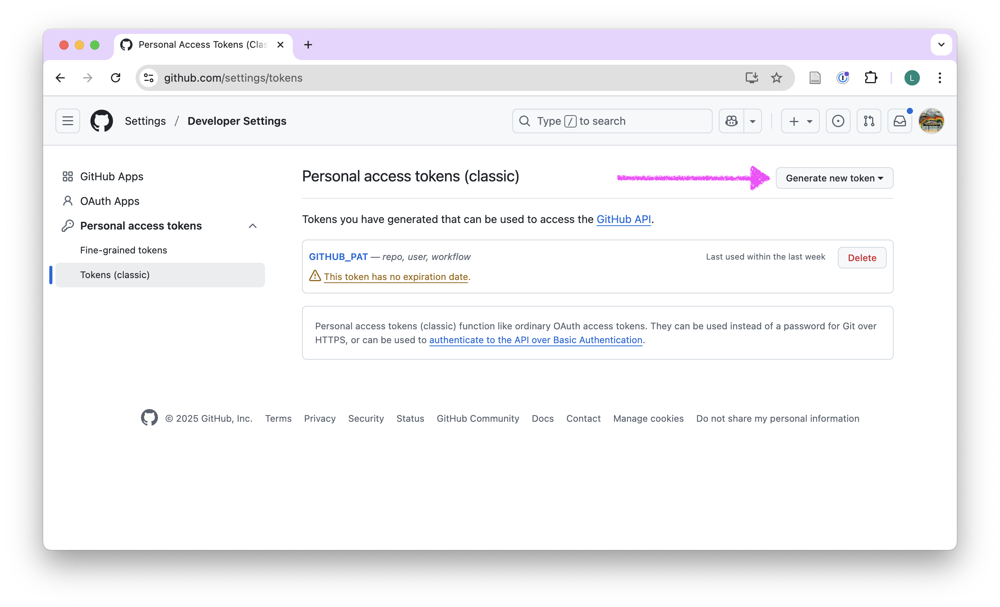{width=100%}

8.  In the [Note]{.highlight-yellow} field, give your token the name: GITHUB_PAT

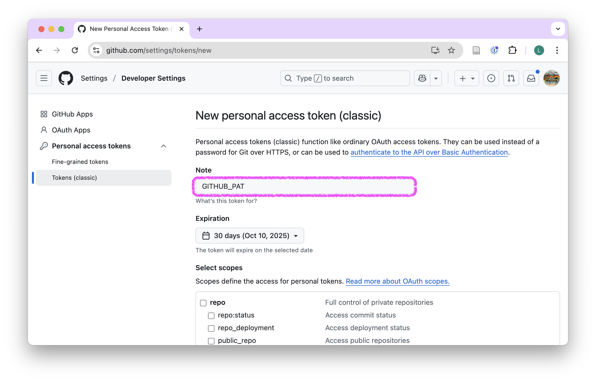{width=100%}

9.  Under Expiration, select [No expiration]{.highlight-yellow}

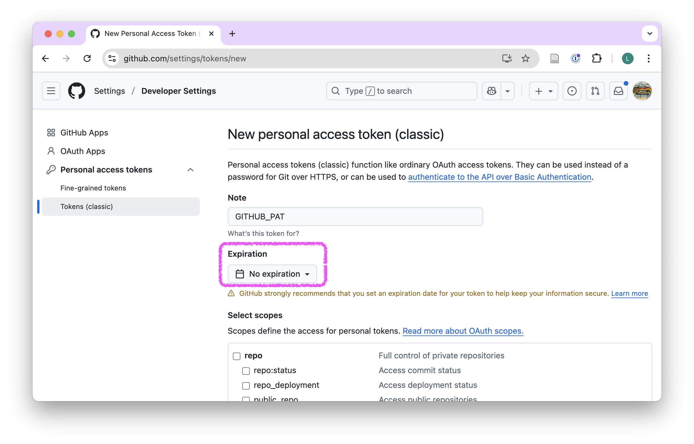{width=100%}

10. Under [Select scopes]{.highlight-yellow}, select: [repo, workflow]{.highlight-yellow}

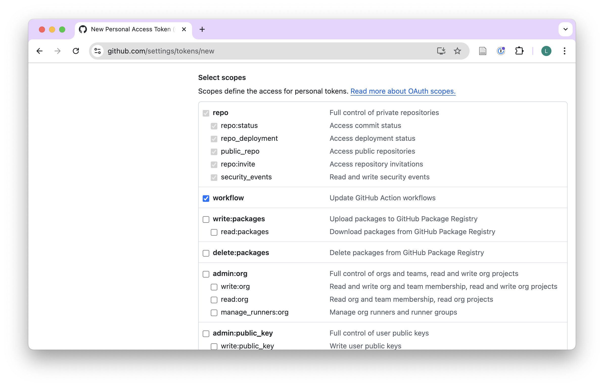{width=100%}

11. Also select [user]{.highlight-yellow} a bit further down the list.

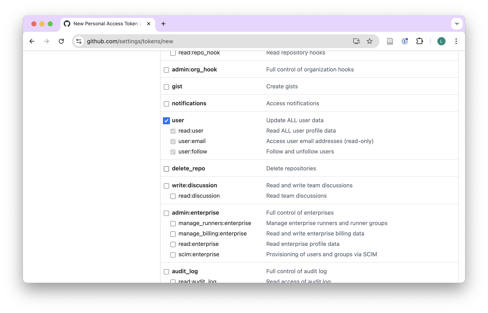{width=100%}

12. Click on [Generate token]{.highlight-yellow}.

{width=100%}

13. Your personal access token will be displayed on the screen. Copy it to your clipboard by [clicking the copy icon]{.highlight-yellow} next to the token. Make sure to copy it immediately, as you will not be able to see it again after you leave the page.

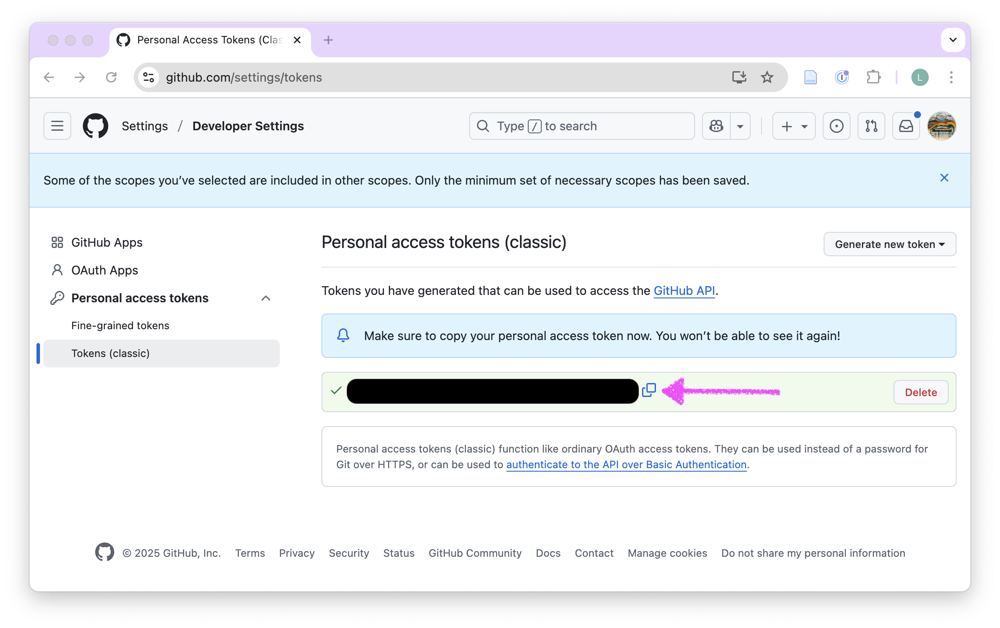{width=100%}

14. Do [not]{.highlight-yellow} copy and store the token in a [Word document (DOCX)]{.highlight-yellow}. Copy and store the token in an appropriate password manager. If you do not have a password manager, you can use a text file (.txt), but make sure to keep it secure and do not share it with anyone. On Windows, you can use Notepad, and on macOS, you can use TextEdit.

::: {.callout-tip}
You will need this token in your pre-course work and throughout the course. Make sure to keep it secure and do not share it with anyone. [If you lose the token, you can generate a new one.]{.highlight-yellow}
:::

Continue with the next assignment: [Complete the pre-course survey](am-01-5-pre-course-survey.qmd).
