::: {.callout-note}
## Screenshots will be updated
The screenshots in this assignment are from a previous course iteration and will be updated before the class starts.
:::

## Complete the GitHub workflow

In this assignment, you will configure Git, then commit and push your first changes to GitHub.

## Step 1: Introduce yourself to git

1. In Posit Cloud, open the [md-02-USERNAME]{.highlight-yellow} project that ends with your GitHub username. Ensure that you are in the workspace of []{.highlight-yellow}. You can verify this by looking at the top left corner next to your repository name. If this says [Your Workspace]{.highlight-yellow}, then you are in the wrong place. In this case, return to the previous assignment and ensure to clone the repository into the []{.highlight-yellow} workspace.

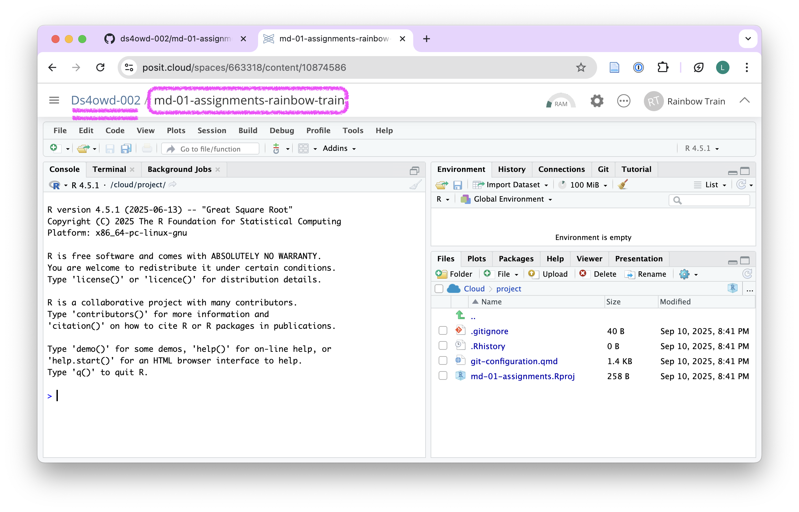{width=100%}

2. Open the [git-configuration.qmd]{.highlight-yellow} file from the bottom right window of RStudio by clicking on the file name in the Files pane. The file opens in the Source pane in the top-left window of RStudio.

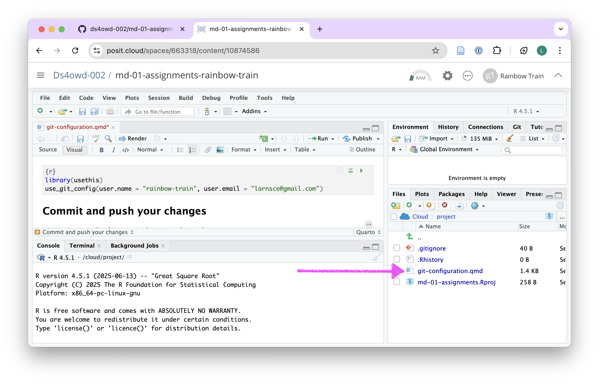{width=100%}

3. Under the heading [Git configuration]{.highlight-yellow} edit the code in the code chunk:

- Replace the placeholder [Your Name]{.highlight-yellow} with your GitHub username
- Replace [Your Email]{.highlight-yellow} with your email address
- Keep the quotes!

These will be the details that git will use to identify you when you make changes to your work.

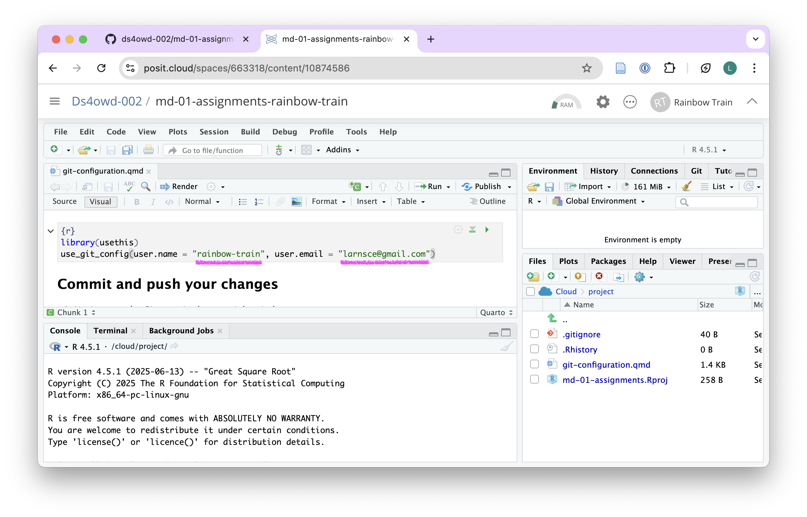{width=100%}

4. Save the file by clicking on the [Save]{.highlight-yellow} icon in the Source pane or by pressing `Ctrl + S` (Windows/Linux) or `Cmd + S` (Mac).

5. Render the document by clicking the [Render]{.highlight-yellow} button in the Source pane.

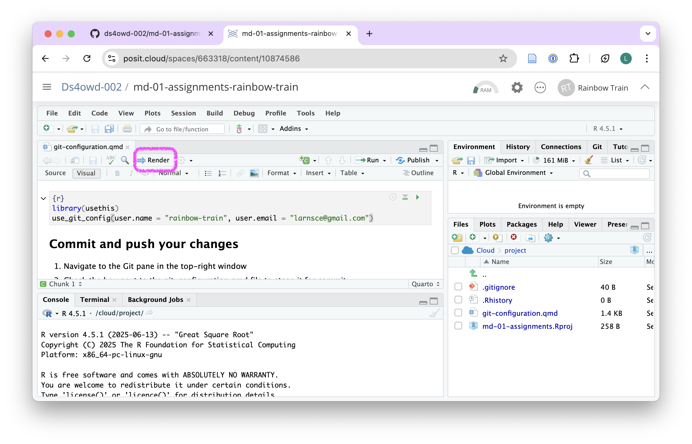{width=100%}

6. Continue with the next step.

## Step 2: Commit and push your changes

1. Navigate to the Git pane in the top-right window of RStudio.

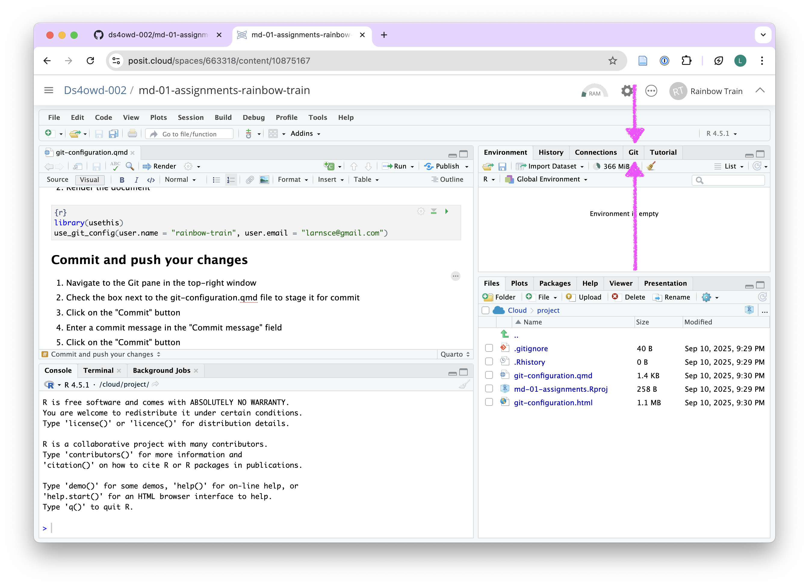{width=100%}

2. Check the box next to the git-configuration.qmd file to stage it for commit.

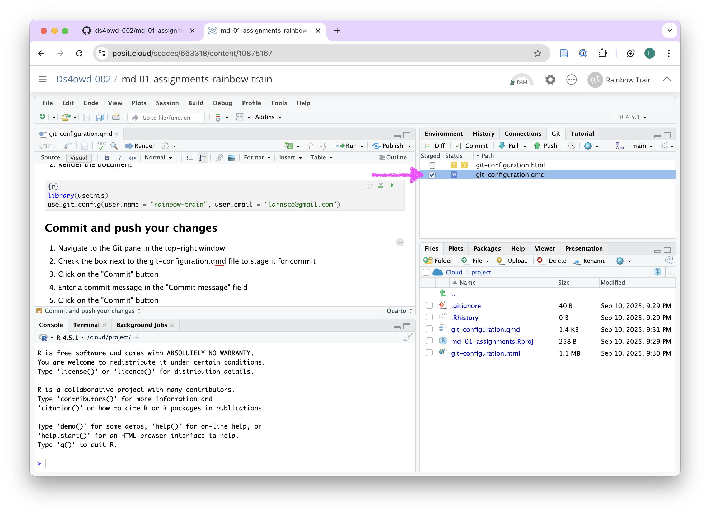{width=100%}

3. Click on the [Commit]{.highlight-yellow} button. A new window opens.

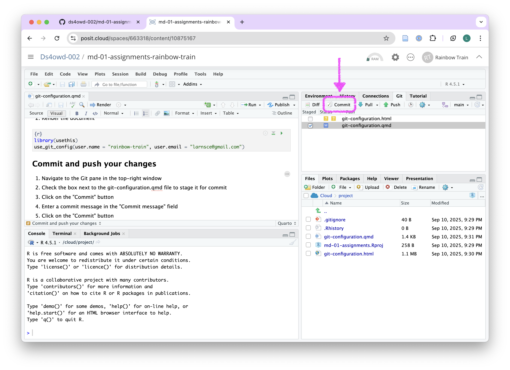{width=100%}

4. Enter a commit message in the [Commit message]{.highlight-yellow} field in the top right corner. For example: replaced placeholders with my details.

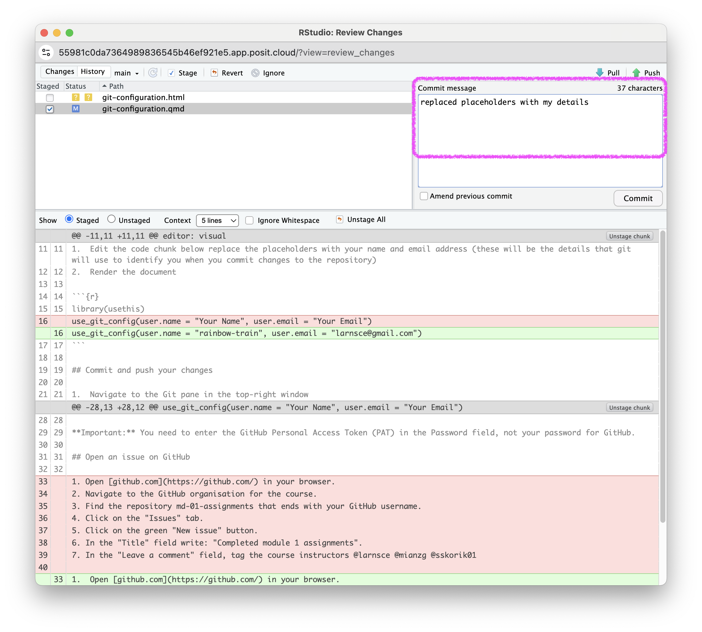{width=100%}

5. Click on the [Commit]{.highlight-yellow} button.

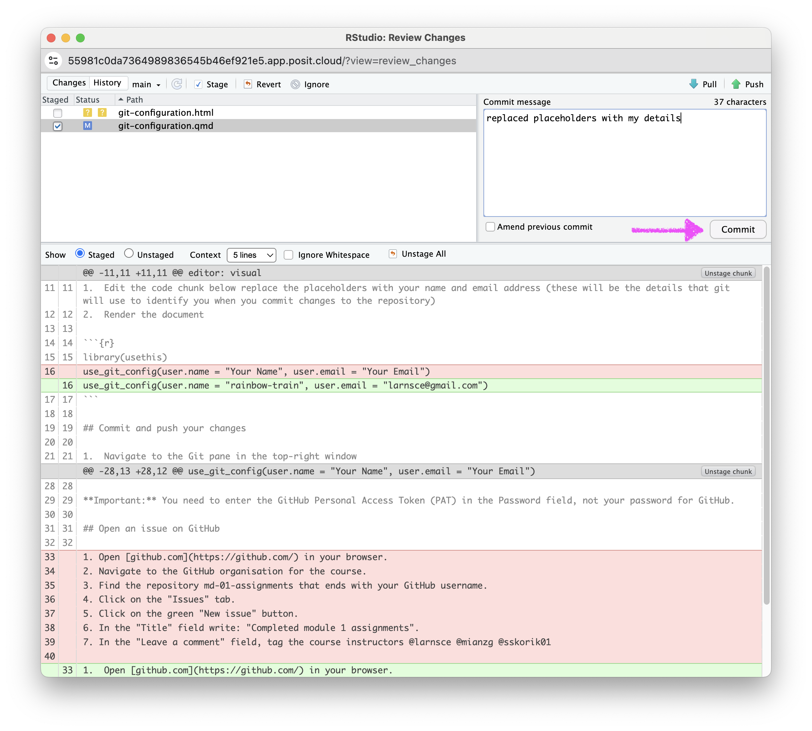{width=100%}

6. If you see a message similar to the screenshot, you have successfully committed your changes to the local repository. Click on [Close]{.highlight-yellow}. If you do not see this message, make sure you have staged the file (checked the box next to it) for commit and entered a commit message.

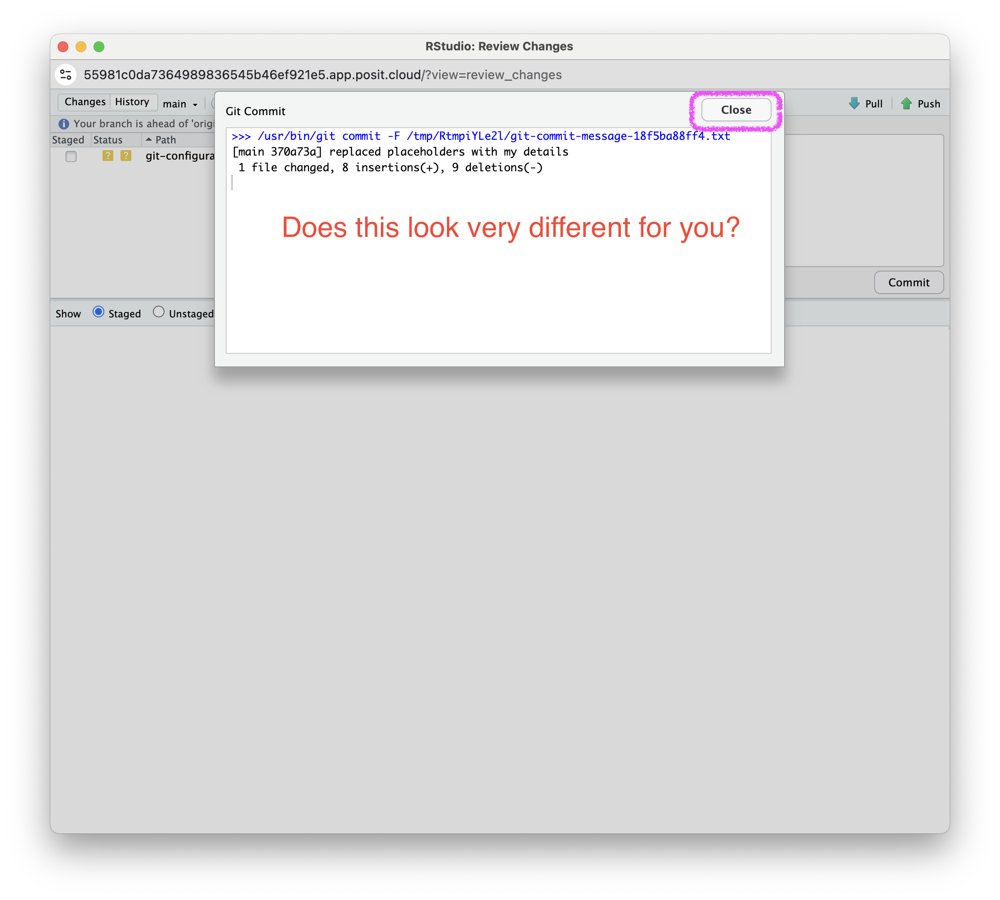{width=100%}

7. Click on the [Push]{.highlight-yellow} button in the top right corner.

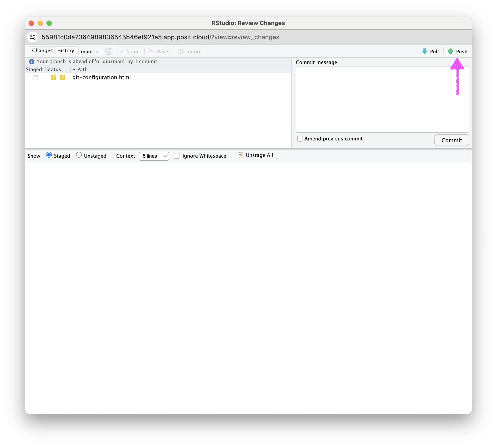{width=100%}

8. Enter your GitHub username and click OK.

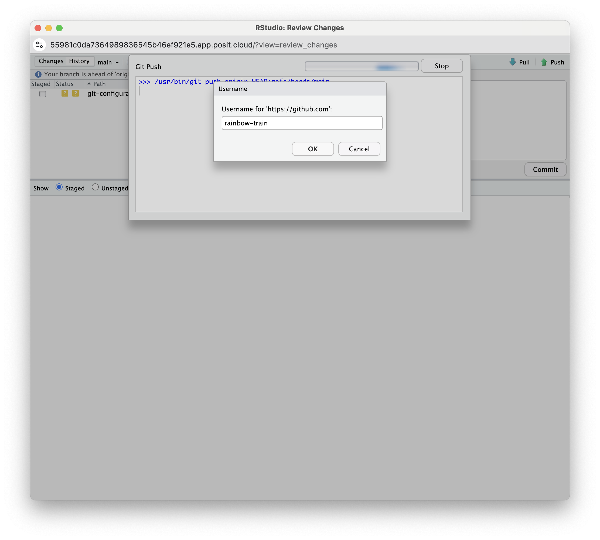{width=100%}

9. Enter your GitHub Personal Access Token (PAT) in the field and click OK. This is the personal access token you created in [Assignment 4](../md-01/am-01-4-github-pat.qmd).

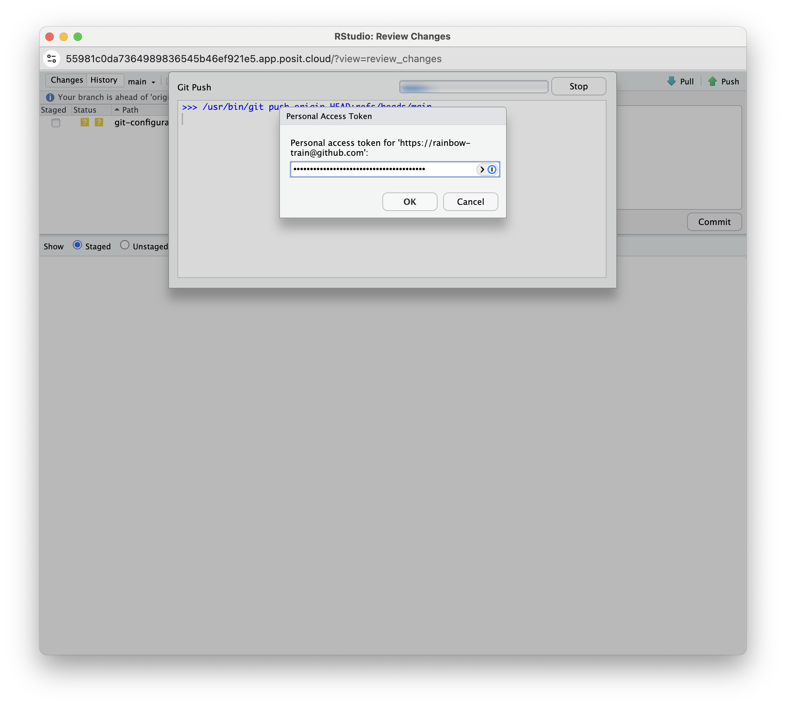{width=100%}

If you see a message that says `HEAD -> main`, then you have successfully pushed your changes to the remote repository on GitHub. Click Close. [If you do not see this message]{.highlight-yellow}, make sure you have entered your GitHub username and GitHub PAT correctly.

::: {.callout-warning}
## PAT Storage Warning

If you have stored your PAT in a Word file, a blank space might have been copied along with the PAT. We recommend using a TXT file (Notepad on Windows or TextEdit on Mac) or a password manager to store your PAT securely.
:::

You have now completed the GitHub workflow for Module 2.
