::: {.callout-warning}
## Screenshots show a different course
The screenshots in this assignment show a class titled `ds4owd-002`. They were carried over from another course and have not yet been updated. For this course, you must use `cven5999-ss26` wherever you see `ds4owd-002` in the screenshots.
:::

## Organize your digital workspace

Throughout this course, you'll be frequently accessing various websites and platforms. Setting up a well-organized bookmark system will save you time and help you stay focused on learning data science rather than searching for links.

::: {.callout-note}
## Chrome-focused instructions
These instructions are written specifically for Google Chrome users. If you're using a different browser, the general concepts still apply but menu locations and keyboard shortcuts may differ.
:::

::: {.callout-tip}
## Browser hygiene for better focus and performance
Before starting this assignment (and before each module's lectures), consider these browser hygiene practices:

[Close unnecessary tabs]{.highlight-yellow}: Start fresh by closing all open tabs except the one you're currently using. This helps you focus and reduces memory usage.

[Optional - Clear browsing data]{.highlight-yellow}: For optimal browser performance, you can clear your cache and browsing history ([Three dots menu]{.highlight-yellow} → [Settings]{.highlight-yellow} → [Privacy and security]{.highlight-yellow} → [Clear browsing data]{.highlight-yellow}).

[Note]{.highlight-yellow}: Clearing browsing data will log you out of most websites, so only do this if you're comfortable signing back into your accounts. Many people find this intimidating, but it can significantly improve browser performance, especially on older computers.
:::

## Step 1: Create a dedicated bookmarks folder in Chrome

1. Open Chrome.

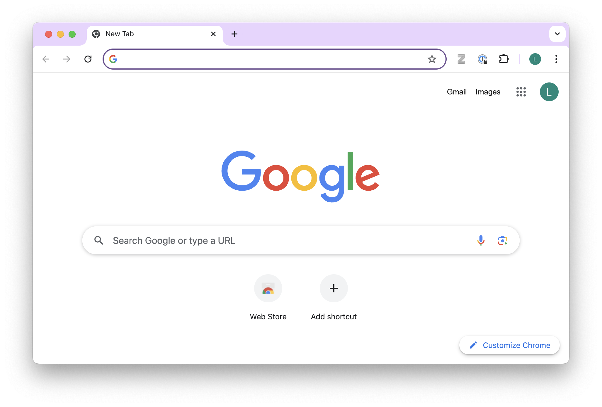{width=100%}

2. Click on the [three dots menu]{.highlight-yellow} in the top-right corner.

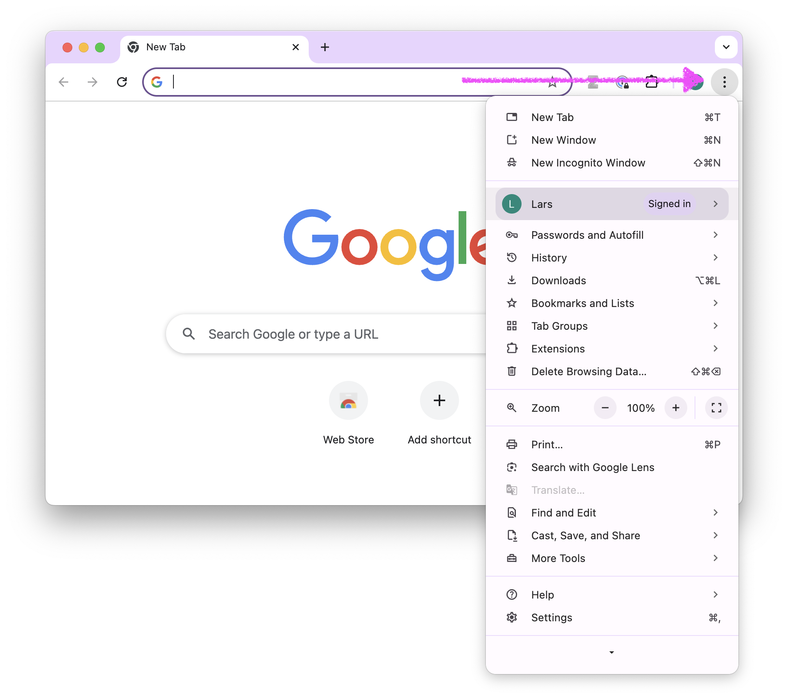{width=100%}

3. Click on [Bookmarks and Lists]{.highlight-yellow} -> Click on [Show Bookmarks Bar]{.highlight-yellow}.

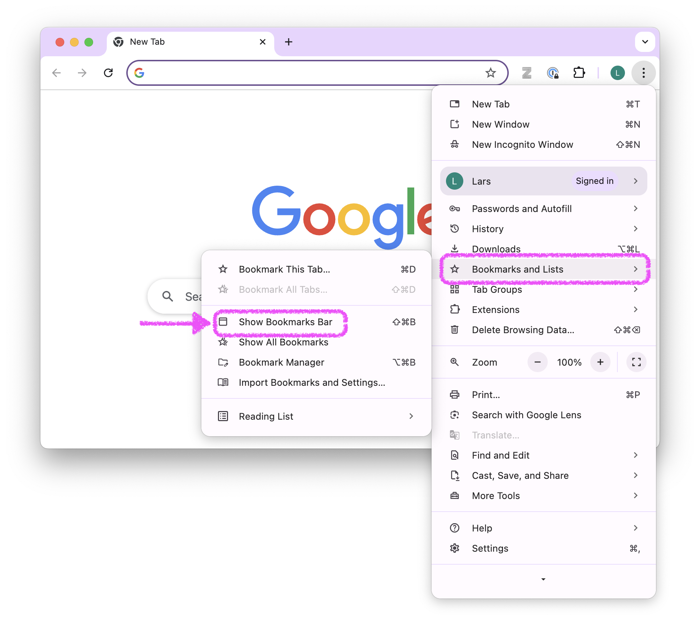{width=100%}

4. A bookmarks bar appears below the address bar in your browser. It might have already been there.

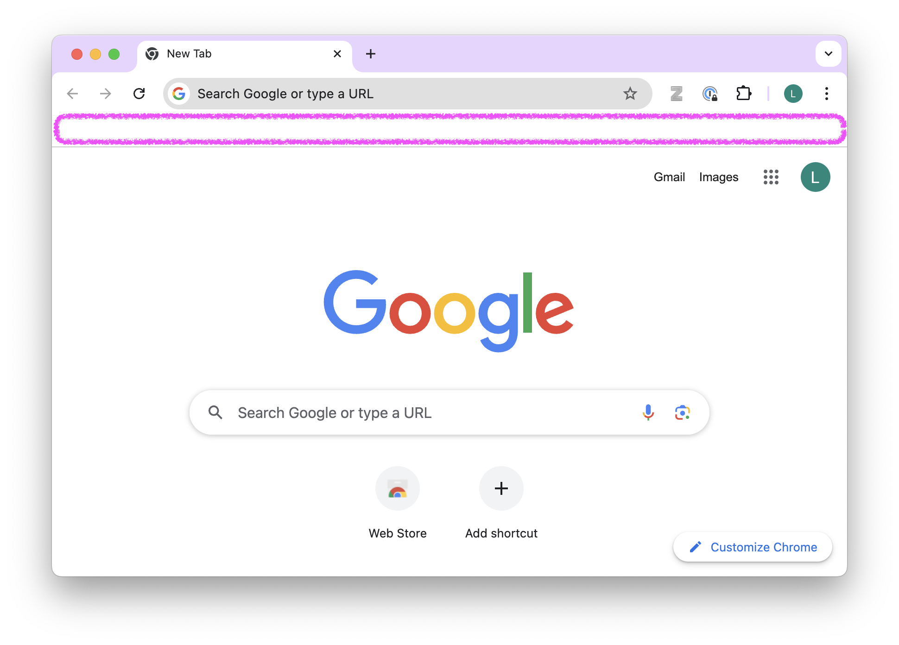{width=100%}

5. Right-click on the bookmarks bar and select [Add Folder...]{.highlight-yellow}.

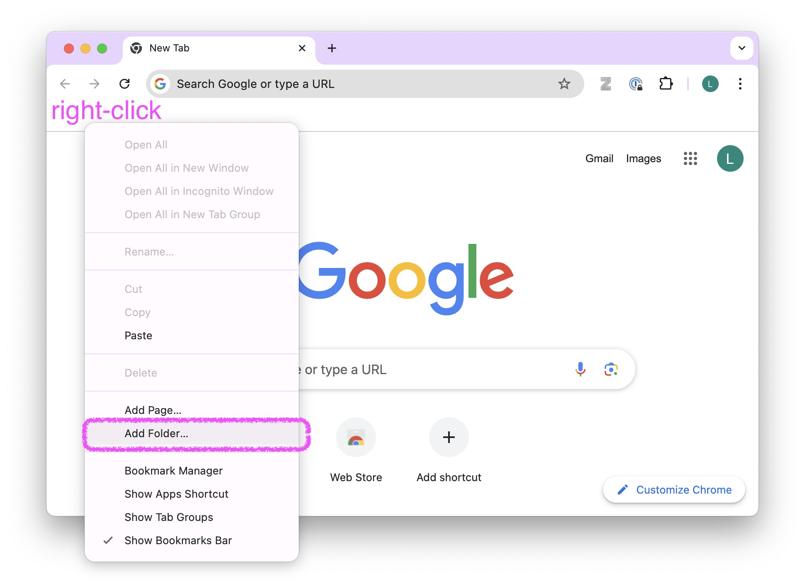{width=100%}

6. Name the folder []{.highlight-yellow} in the Name field. Ensure that in the window below, [Bookmarks Bar]{.highlight-yellow} is selected as the location. Click [Save]{.highlight-yellow}.

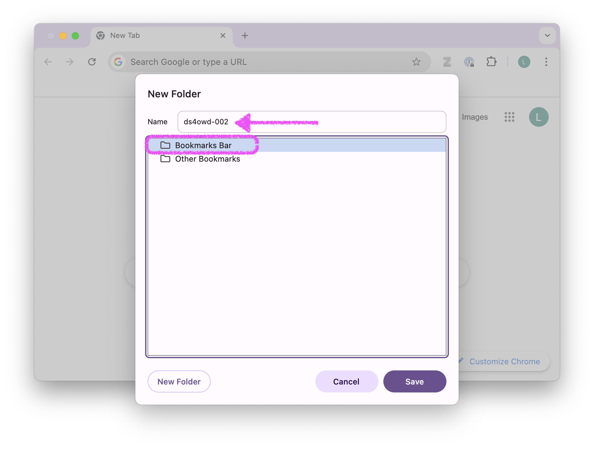{width=100%}

7. The folder []{.highlight-yellow} should now appear in your bookmarks bar.

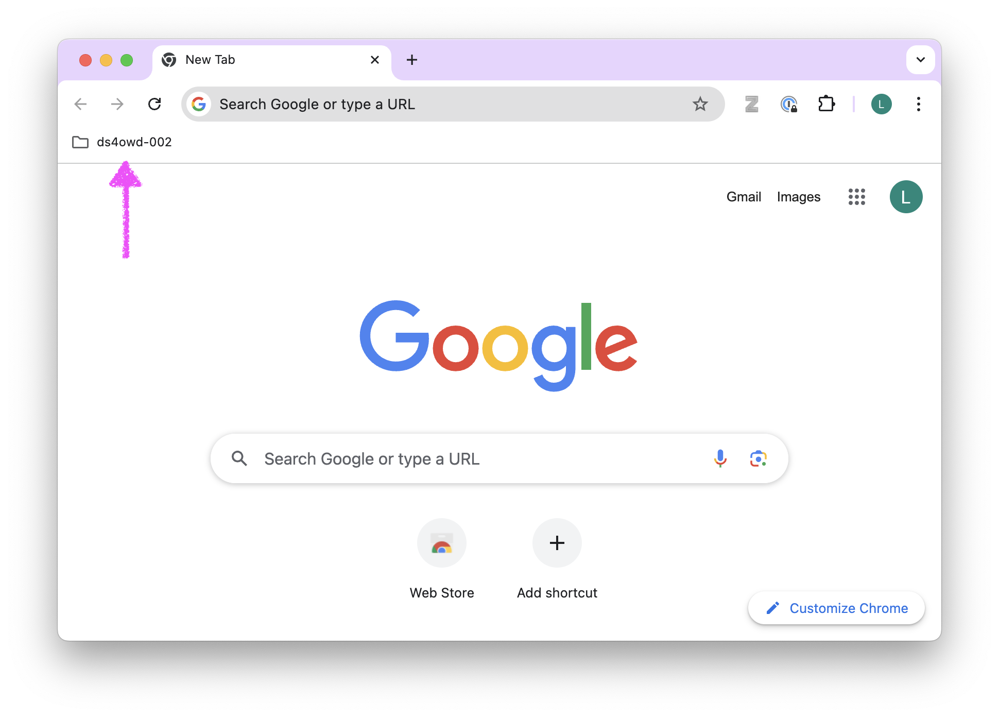{width=100%}

## Step 2: Add the course website to your folder

1. Navigate to the course website: []().

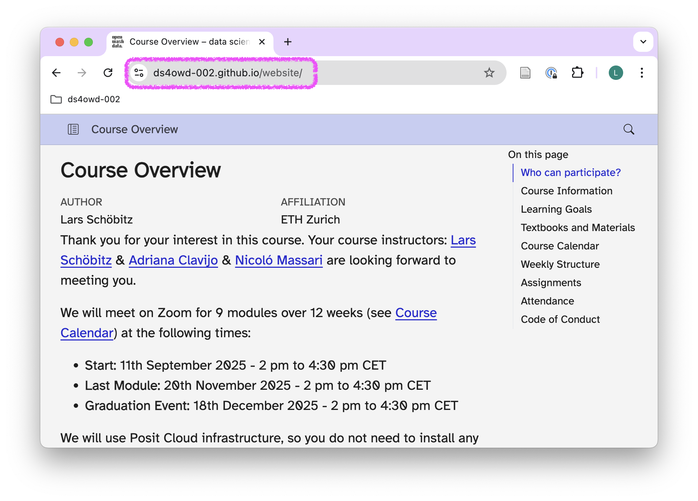{width=100%}

2. Click the [star icon]{.highlight-yellow} in the address bar.

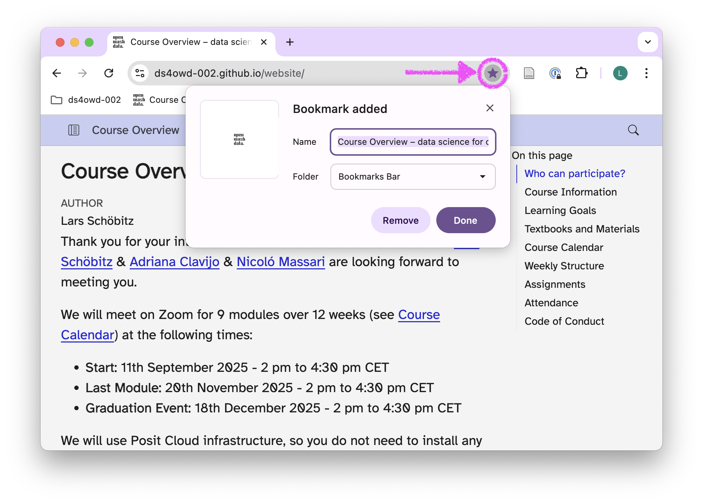{width=100%}

3. In the popup, add [course website]{.highlight-yellow} for the Name field.

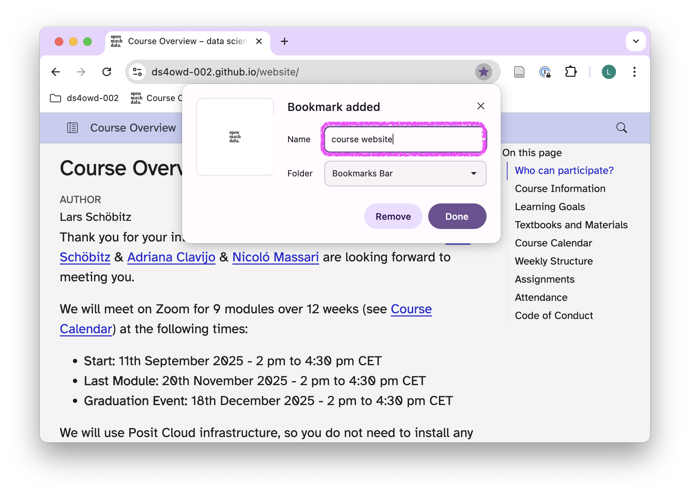{width=100%}

4. Click the [Folder]{.highlight-yellow} dropdown and select your []{.highlight-yellow} folder.

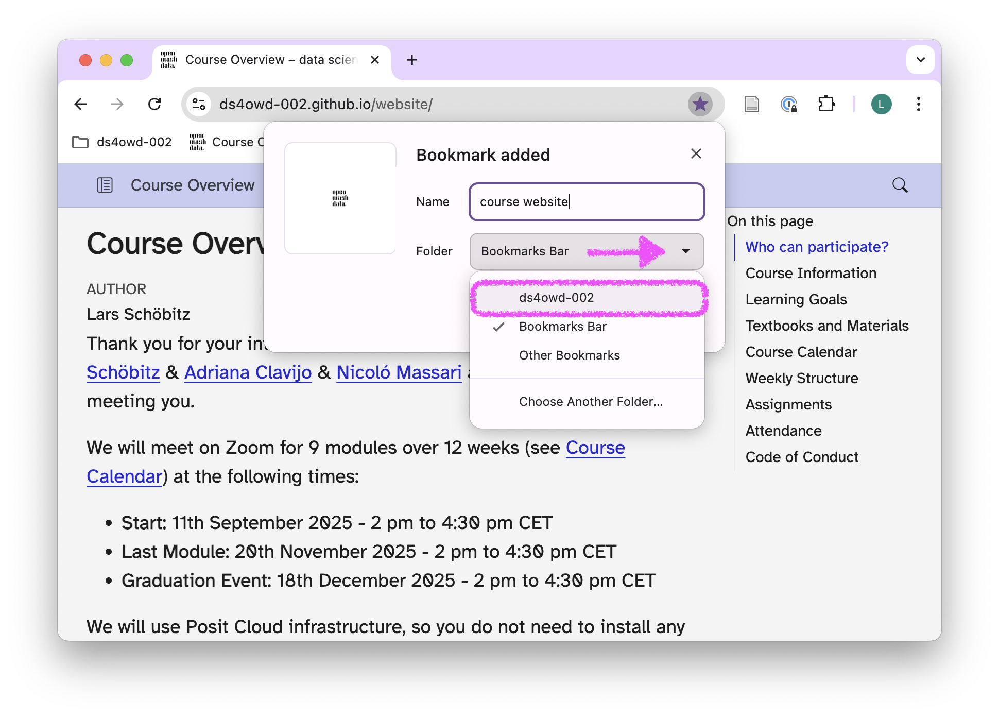{width=100%}

5. Click [Done]{.highlight-yellow}.

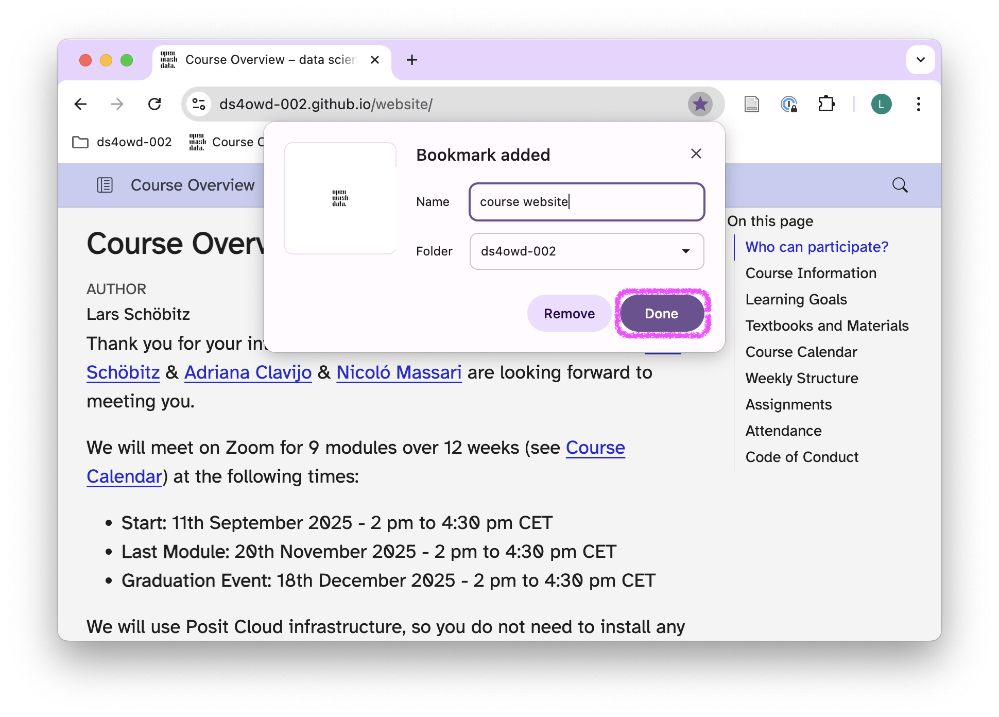{width=100%}

6. Click on your []{.highlight-yellow} folder in the bookmarks bar to verify the bookmark was added.

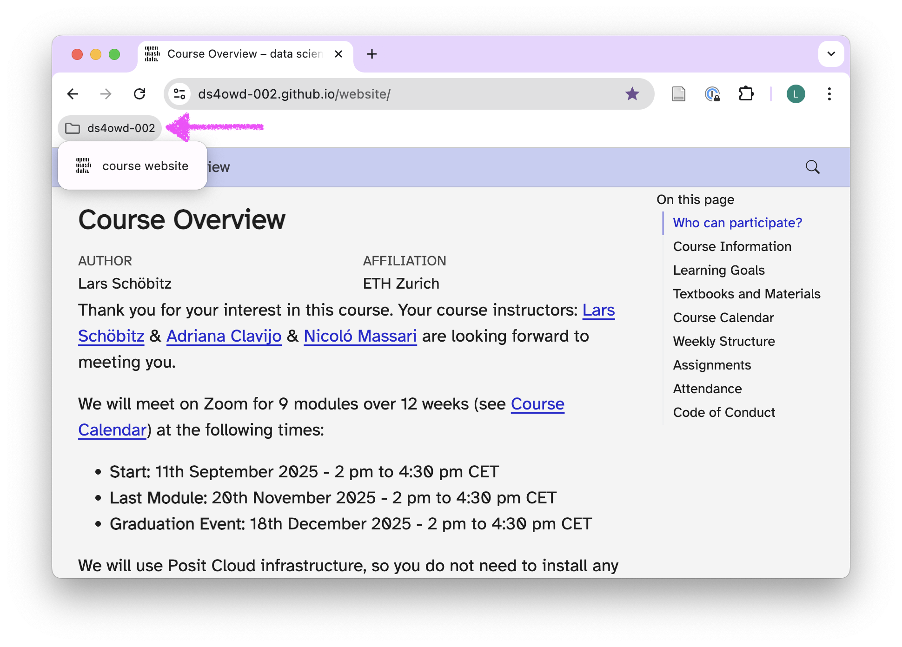{width=100%}

## Step 3: Add other essential course links

Add the following bookmarks to your []{.highlight-yellow} folder. For each bookmark, follow the instructions as in Step 2.

### Essential course links

1. [Posit Cloud workspace]{.highlight-yellow}: []()
   - Name it: [Posit Cloud - ]{.highlight-yellow}

2. [GitHub organization]{.highlight-yellow}: []()
   - Name it: [GitHub - course org]{.highlight-yellow}

3. [Canvas course page]{.highlight-yellow}: <https://canvas.colorado.edu/courses/143788>
   - Name it: [Canvas - ]{.highlight-yellow}

## Step 4: Take a screenshot

1. Click on your []{.highlight-yellow} folder in the bookmarks bar to verify all bookmarks were added correctly.

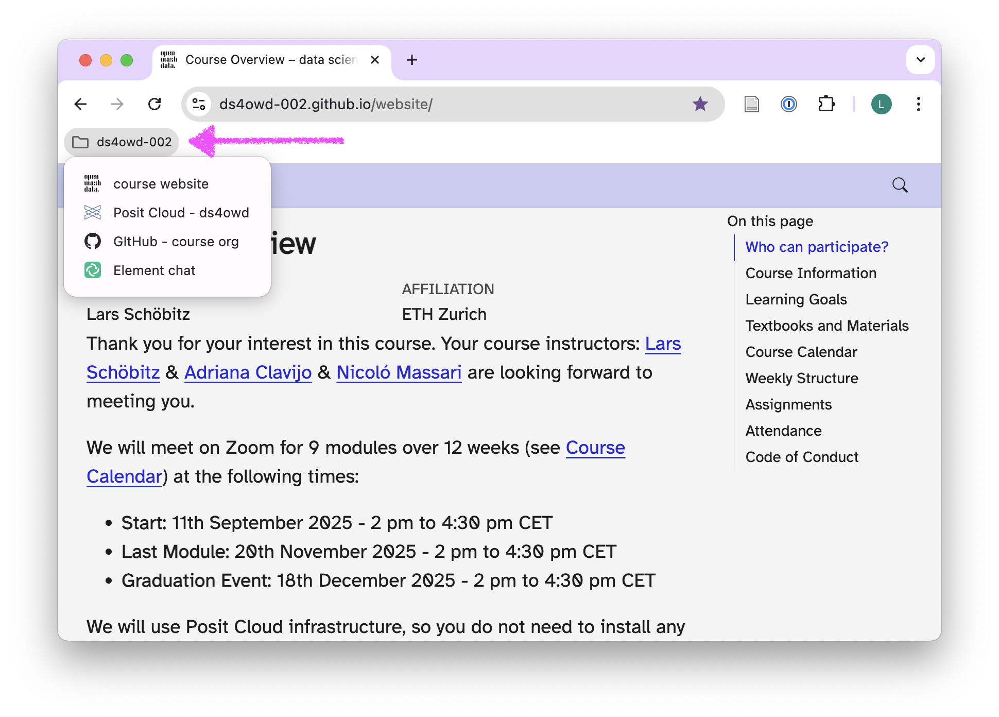{width=100%}

2. Take a screenshot of your browser showing the expanded folder with all bookmarks.

3. Save this screenshot as you will need it to complete this assignment.

## Step 5: Open an issue on GitHub

1. Open <https://github.com/> in your browser.

2. Navigate to the GitHub organization for the course: []()

3. Find the repository `md-03-USERNAME` that [ends with your GitHub username]{.highlight-yellow}, and open it by clicking on the repository name.
   - Replace `USERNAME` with your actual GitHub username.
   - For example, if your username is `johnsmith`, the repository will be `md-03-johnsmith`.

::: {.callout-tip}
You can search for your repository by typing your username in the search bar just below the Repository heading.
:::

4. Click on the [Issues]{.highlight-yellow} tab.

5. Click on the green [New issue]{.highlight-yellow} button.

6. In the [Title]{.highlight-yellow} field write: [Bookmarks setup completed]{.highlight-yellow}.

7. In the [Leave a comment]{.highlight-yellow} field:
   - Drag and drop your screenshot from Step 4 into the comment field, or click [Attach files by dragging & dropping]{.highlight-yellow}.
   - Add a brief message like: "I have set up my bookmarks folder for  with all essential course links."
   - Tag the course instructor `@larnsce`.

8. Scroll down the page a bit and click the green [Create]{.highlight-yellow} button.

Congratulations! You have successfully organized your bookmarks and documented your setup.

## Step 6: Create sub-folders for better organization in Chrome [optional]{.highlight-yellow}

As the course progresses, organize your Chrome bookmarks with sub-folders:

1. Right-click on your []{.highlight-yellow} folder.

2. Select [Add new folder]{.highlight-yellow}.

3. Create these sub-folders:
   - [Assignments]{.highlight-yellow} - for your personal assignment repositories
   - [Resources]{.highlight-yellow} - for R documentation, package sites
   - [Data]{.highlight-yellow} - for data sources

### Recommended additional bookmarks

Add these to your [Resources]{.highlight-yellow} sub-folder:

- [R for Data Science book]{.highlight-yellow}: <https://r4ds.hadley.nz/>
- [ggplot2 documentation]{.highlight-yellow}: <https://ggplot2.tidyverse.org/>
- [RStudio cheatsheets]{.highlight-yellow}: <https://posit.co/resources/cheatsheets/>

## Tips

::: {.callout-tip}
## Sync Chrome bookmarks across devices
To sync your bookmarks across all your devices:
1. Click your [profile icon]{.highlight-yellow} in the top-right corner of Chrome.
2. Click [Turn on sync]{.highlight-yellow}.
3. Sign in with your Google account.
4. Your  bookmarks will now be available on all devices where you're signed into Chrome.
:::
