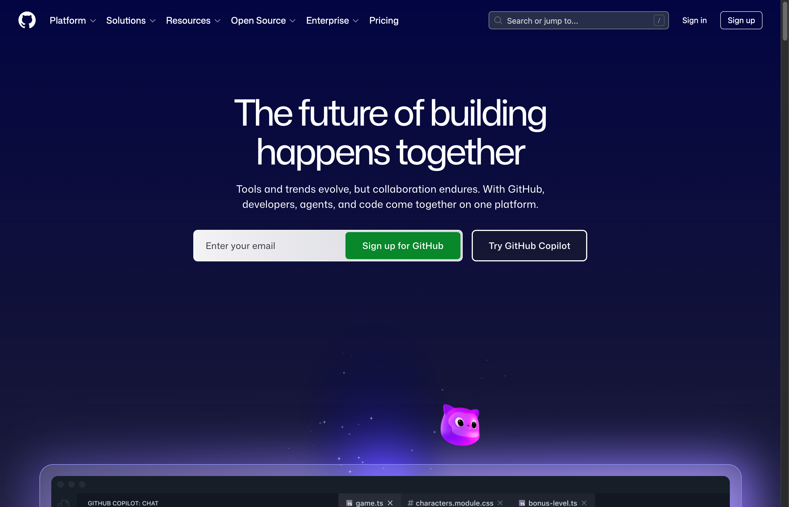
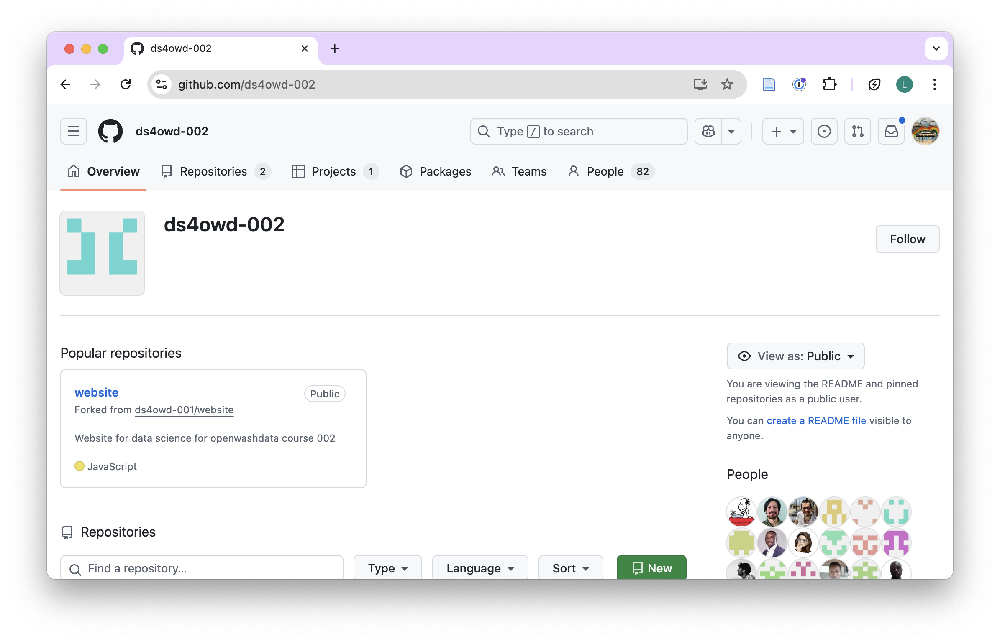
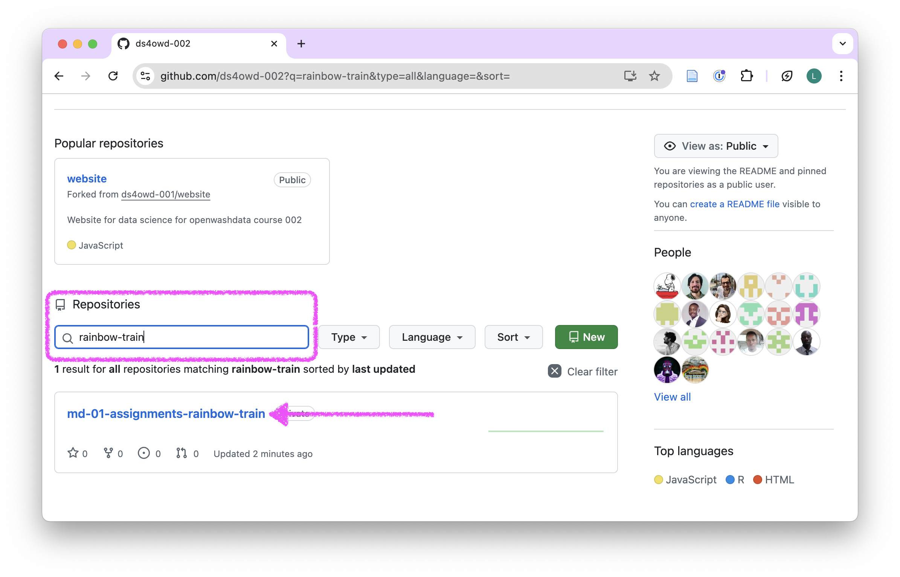
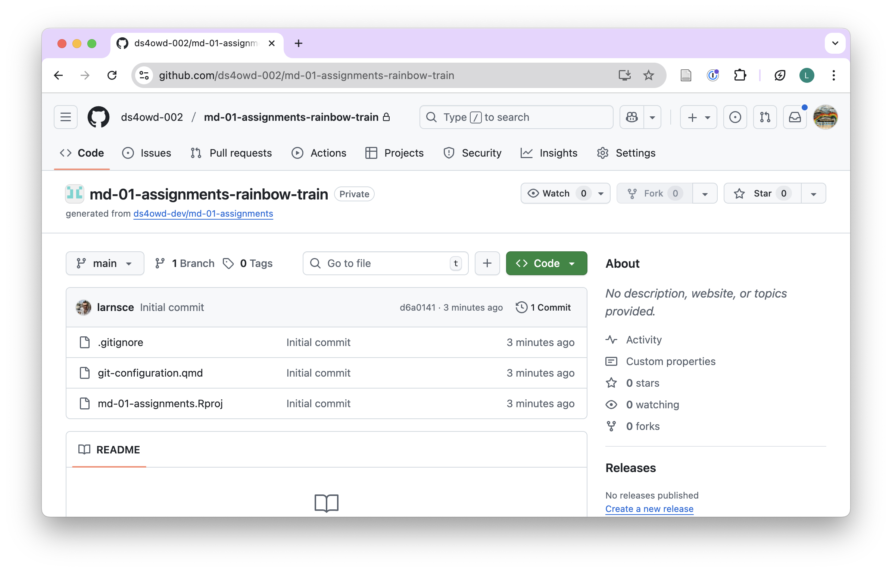
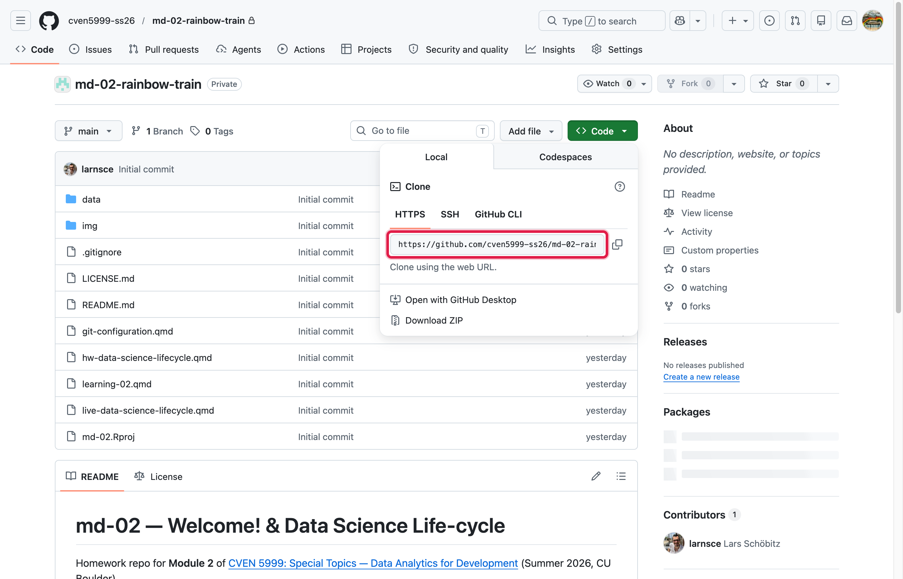
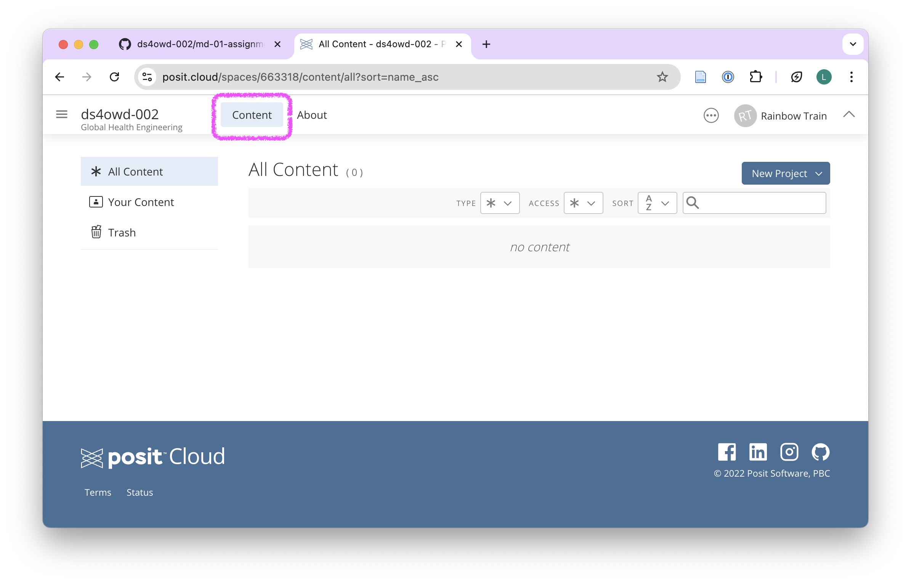
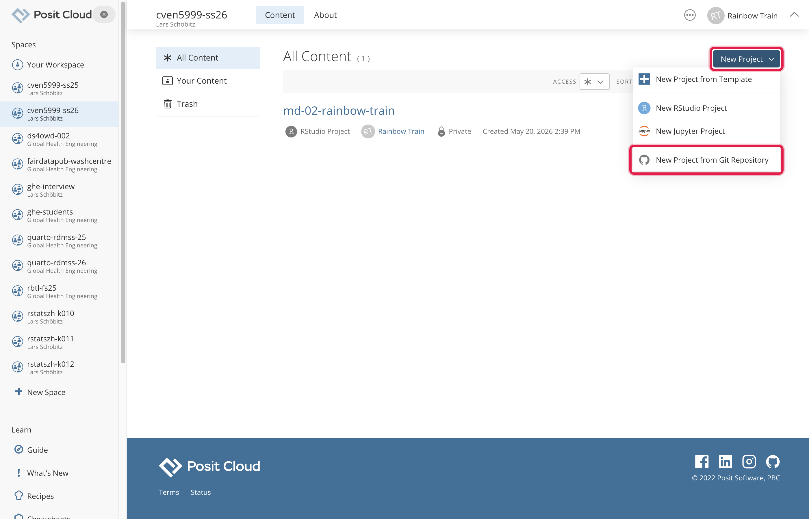
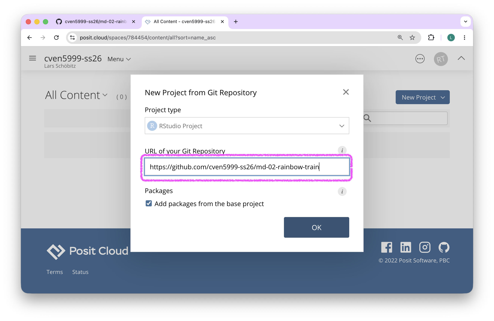
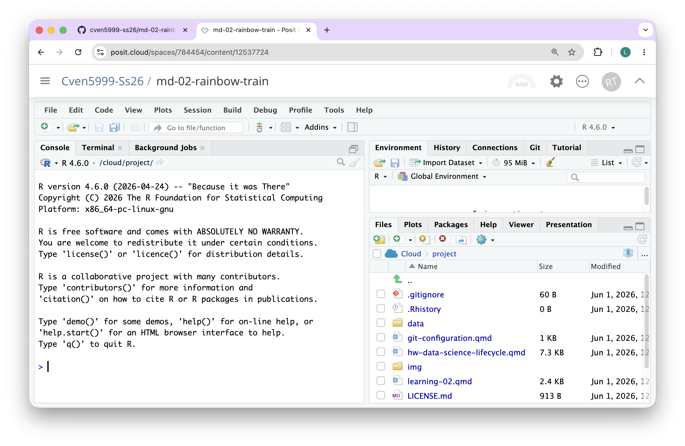

## Clone a repository

In this assignment, you will clone your personal Module 3 repository from GitHub to Posit Cloud.

::: {.callout-note}
The clone steps documented here are a one-time setup per homework repository: each new homework repo (Module 3, 4, 5, 6, 7) needs to be cloned to Posit Cloud once. The repeating part of the workflow is stage, commit, push, which you will do at the end of each module; see [Assignment 4: GitHub workflow](am-03-4-github-workflow.qmd) for those steps.
:::

1. Open <https://github.com/> in your browser. Login with your username if you are not logged in yet.

{width=100%}

2. Navigate to the GitHub organization for the course: []()

{width=100%}

3. Find the repository `md-03-USERNAME` that [ends with your GitHub username]{.highlight-yellow}, and open it by clicking on the repository name.

- Replace `USERNAME` with your actual GitHub username.
- For example, if your username is `johnsmith`, the repository will be `md-03-johnsmith`.

::: {.callout-tip}
You can search for your repository by typing your username in the search bar just below the Repository heading.
:::

{width=100%}

4. Click on the green [Code]{.highlight-yellow} button.

{width=100%}

5. Copy the HTTPS URL to your clipboard by clicking on the clipboard icon next to the URL.

{width=100%}

6. Open the [Content]{.highlight-yellow} tab of the  workspace on Posit Cloud: [content/all?sort=name_asc](content/all?sort=name_asc)

{width=100%}

7. Click the blue button [New Project]{.highlight-yellow} > [New Project from Git Repository]{.highlight-yellow}

{width=100%}

8. Paste the HTTPS URL from GitHub into the [URL of your Git Repository]{.highlight-yellow} field and click [OK]{.highlight-yellow}. Leave the checkbox under Packages checked.

{width=100%}

9. Wait until the project is deployed. This may take a few minutes, depending on your internet connection.

{width=100%}

10. Continue with the next assignment: [GitHub workflow](am-03-4-github-workflow.qmd).
